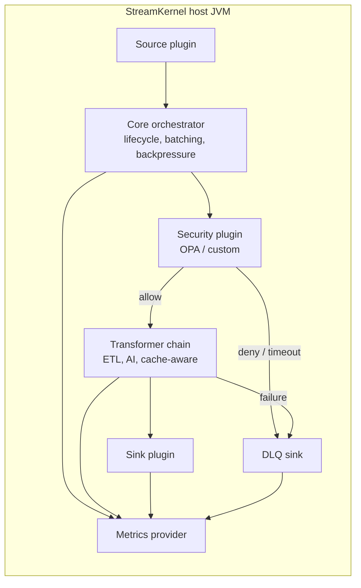

# Architecture

StreamKernel is a transport-agnostic Java 21 event orchestration engine. The core runtime owns lifecycle, batching, policy checks, backpressure, DLQ routing, provenance, and dispatch. Sources, transforms, sinks, caches, security providers, and metrics backends are supplied through SPI plugins.

Kafka is one supported transport, not the kernel. The same orchestrator path can run Kafka, Pulsar, REST, synthetic, Delta Lake, Snowflake, MongoDB, DevNull, and AI inference profiles from configuration.

## Module Boundaries

`streamkernel-api`, `streamkernel-spi`, and `streamkernel-metrics/metrics-api` are the Apache 2.0 SDK surface. They contain public event models, plugin contracts, configuration contracts, and metrics extension contracts.

`streamkernel-core` contains the runtime engine. It depends on the SPI, but plugin implementations should not add reverse dependencies back into app bootstrap code.

`streamkernel-app` is the runnable host. It wires configuration, preflight validation, plugin discovery, bootstrap, and optional model lifecycle support.

`streamkernel-kafka`, `streamkernel-avro`, `streamkernel-metrics/*`, and `streamkernel-plugins/*` are first-party runtime integrations governed by the repository license boundary in `LICENSE-HISTORY.md`.

## Plugin Flow

1. A source plugin emits `PipelinePayload` records.
2. The orchestrator batches records, applies backpressure, and invokes security checks.
3. Allowed records pass through the configured transformer chain.
4. Sink plugins write accepted records to the selected destination.
5. Denied, failed, or timed-out records are routed through DLQ handling when configured.
6. Metrics providers publish runtime counters, latency, and health signals.

## Release Hygiene

Public releases keep reproducibility evidence in `benchmark-runs/*.csv` and keep private filing work product, local secrets, transient logs, caches, and build outputs out of the tracked tree. Root notices document the public license, patent, trademark, and third-party boundaries.
