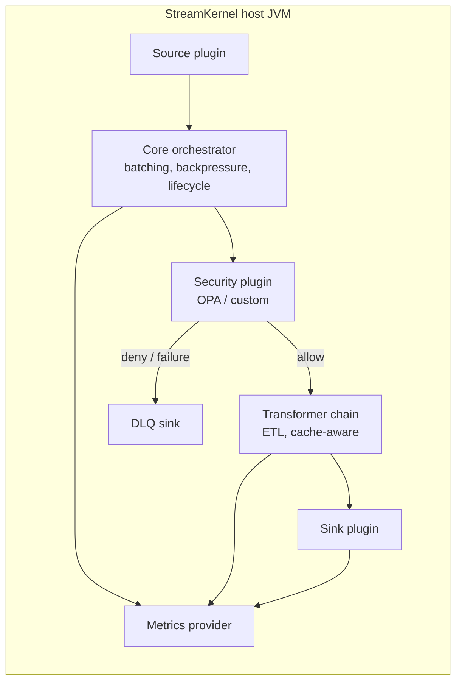

# StreamKernel

[](https://github.com/IntuitiveDesigns/StreamKernel-io/stargazers)
[](https://github.com/IntuitiveDesigns/StreamKernel-io/releases)
[](LICENSE)
[](PATENT-NOTICE.md)

<p align="center">
  
  
  
  
  
  
  
  
  
  
  
  
  
  
</p>

Architected by [Steven Lopez](https://www.linkedin.com/in/steve-lopez-b9941/).

StreamKernel is a source-available event pipeline runtime for teams that need policy, transformation, caching, DLQ routing, and multi-destination delivery inside one fast, auditable JVM process.

The category is not "another Kafka client" or "a smaller Spark." StreamKernel sits between event transport, operational systems, and analytical platforms: a programmable pipeline kernel for operational data movement where every extra service hop adds latency, cost, failure modes, and compliance work.

## Buyer Pain

Most event platforms solve transport, storage, or analytics. Production teams still have to glue together policy sidecars, cache clients, DLQs, schema transforms, metrics, retry logic, and destination-specific writers. That glue becomes the product: it is expensive to build, hard to benchmark, harder to audit, and painful to move across Kafka, Pulsar, REST, MongoDB, Delta, Snowflake, and local test profiles.

StreamKernel turns that glue into a runtime:

- one `.properties` file per pipeline
- one JVM process for source, policy, transform, cache, sink, DLQ, and metrics
- one SPI for author-owned plugins
- one benchmark runner that records the exact JVM and runtime envelope

## What It Is For

- Regulated event pipelines that need per-batch policy, provenance, DLQ handling, and reproducible evidence.
- Teams that want Kafka, Pulsar, REST, Delta, Snowflake, MongoDB, and DevNull paths without rewriting the orchestration layer.
- Platform teams that want customers or internal groups to bring their own plugins without giving up runtime control.

## Architecture



More detail: [ARCHITECTURE.md](ARCHITECTURE.md) and [MODULES.md](MODULES.md).

## Reproducible Benchmark Suite

The public suite is driven by CSV matrices in `benchmark-runs/`:

- `benchmark-runs/tests.csv`: primary CPU benchmark suite
- `benchmark-runs/tests_oidc.csv`: OIDC/security-oriented suite
- `benchmark-runs/tests_lineage.csv`: provenance/audit evidence
- `benchmark-runs/tests_pulsar.csv`: Pulsar source portability
- `benchmark-runs/tests_pulsar_live.csv`: live Pulsar source pressure
- `benchmark-runs/tests_snowflake.csv`: Snowflake Snowpipe Streaming sink

Each row names the pipeline config, JVM heap, GC mode, runtime duration, topic settings, run ID, executor mode, cache mode, and sink-copy behavior. The runner emits logs, GC output, Prometheus snapshots, effective settings, and `meta.json` for replay.

```powershell
.\gradlew.bat --no-daemon :streamkernel-app:shadowJar
.\test-java-runner.ps1 -MatrixFile .\benchmark-runs\tests.csv -SingleTest streamkernel_kafka_at_least_once_baseline_10m
```

Full instructions: [docs/18_benchmark_runner.md](docs/18_benchmark_runner.md) and [BENCHMARK_SUITE.md](BENCHMARK_SUITE.md).

## Public Use Cases

| Use Case | Command |
|---|---|
| MongoDB insert baseline | `.\test-java-runner.ps1 -MatrixFile .\benchmark-runs\tests.csv -SingleTest streamkernel_mongodb_insert_baseline_10m` |
| Delta/Spark local lakehouse | `.\test-java-runner.ps1 -MatrixFile .\benchmark-runs\tests.csv -SingleTest streamkernel_delta_spark_local_5m` |
| Lineage audit headers | `.\test-java-runner.ps1 -MatrixFile .\benchmark-runs\tests_lineage.csv -SingleTest streamkernel_lineage_audit_10m` |
| Pulsar source drain | `.\test-java-runner.ps1 -MatrixFile .\benchmark-runs\tests_pulsar.csv` |
| Live Pulsar source pressure | `.\test-java-runner.ps1 -MatrixFile .\benchmark-runs\tests_pulsar_live.csv` |
| Snowflake Snowpipe Streaming | `.\test-java-runner.ps1 -MatrixFile .\benchmark-runs\tests_snowflake.csv` |

The Delta/Spark and Snowflake profiles use a deterministic public enrichment transform so the connector paths can be published and replayed without private model artifacts.

## Measured Baselines

Published rows were run on an Intel i9-8950HK laptop with 6 cores, 12 threads, and 32GB RAM against a local Docker environment.

| Profile | Avg Throughput | Records | Delivery | Notes |
|---|---:|---:|---|---|
| Kafka Bench (NOOP) | 956K ops/sec | 563M | At-least-once | Raw Kafka producer ceiling |
| Kafka ALO (WireEvent) | 525K ops/sec | 313M | At-least-once | Transform, 512-byte payload |
| Kafka EOS (WireEvent) | 507K ops/sec | 301M | Exactly-once | -3.5% vs ALO |
| mTLS + OPA (NOOP) | 366K ops/sec | 217M | At-least-once | TLSv1.3 plus fail-closed OPA |
| MongoDB Insert | 163K docs/sec | 95.5M | At-least-once | insertMany baseline |

## Why Not Kafka/Flink/Spark/Databricks Alone?

Use those platforms where they are strongest. StreamKernel is for the operational gap around them: fast per-event intelligence, policy, and delivery inside one embeddable runtime.

| Platform | Strong At | Gap StreamKernel Targets |
|---|---|---|
| Kafka | Durable event transport | Does not provide a pipeline kernel for policy, cache, DLQ, and destination writes. |
| Flink | Stateful stream processing | Heavier cluster/runtime model when the job is local policy, transformation, or sink fanout. |
| Spark | Batch and large-scale analytics | Not designed for low-latency single-process operational event paths. |
| Databricks | Managed lakehouse and ML platform | Excellent destination/control plane, but not a small embeddable runtime for edge or product-owned pipelines. |

Full comparison: [COMPARISON.md](COMPARISON.md).

## SPI Moat

The Apache 2.0 SDK modules expose the plugin contracts. Plugin authors implement `SourcePlugin`, `TransformerPlugin`, `SinkPlugin`, cache, security, DLQ, or metrics contracts and keep their plugin IP. StreamKernel keeps the runtime kernel, lifecycle, batching, backpressure, policy, provenance, metrics, and DLQ semantics consistent.

Example: [docs/plugin-example.md](docs/plugin-example.md).

## Five-Minute Demo

Use the demo script to show the value quickly: build the JAR, run a reproducible benchmark row, inspect the matrix, point to the architecture, and close on plugin ownership plus commercial licensing.

Script: [DEMO_5_MIN.md](DEMO_5_MIN.md).

## Licensing

Clear boundary:

- Core runtime and first-party modules are source-available under the StreamKernel Source Available License.
- `streamkernel-api`, `streamkernel-spi`, and `streamkernel-metrics/metrics-api` are Apache 2.0 SDK modules.
- Custom plugins built against the SDK remain author-owned. The StreamKernel license does not take ownership of independently authored plugins.
- Commercial licenses are available for redistribution, OEM embedding, managed services, support, and negotiated patent rights.

Details: [LICENSE-HISTORY.md](LICENSE-HISTORY.md), [COMMERCIAL.md](COMMERCIAL.md), [PATENT-NOTICE.md](PATENT-NOTICE.md), and [THIRD-PARTY-NOTICES.md](THIRD-PARTY-NOTICES.md).

## Quick Links

| Need | Link |
|---|---|
| Architecture | [ARCHITECTURE.md](ARCHITECTURE.md) |
| Module boundaries | [MODULES.md](MODULES.md) |
| Benchmark suite | [BENCHMARK_SUITE.md](BENCHMARK_SUITE.md) |
| Runner details | [docs/18_benchmark_runner.md](docs/18_benchmark_runner.md) |
| Platform comparison | [COMPARISON.md](COMPARISON.md) |
| Demo script | [DEMO_5_MIN.md](DEMO_5_MIN.md) |
| Plugin example | [docs/plugin-example.md](docs/plugin-example.md) |
| Commercial licensing | [COMMERCIAL.md](COMMERCIAL.md) |

Contact: [LinkedIn](https://www.linkedin.com/in/steve-lopez-b9941/) · [GitHub Issues](https://github.com/IntuitiveDesigns/StreamKernel-io/issues)
