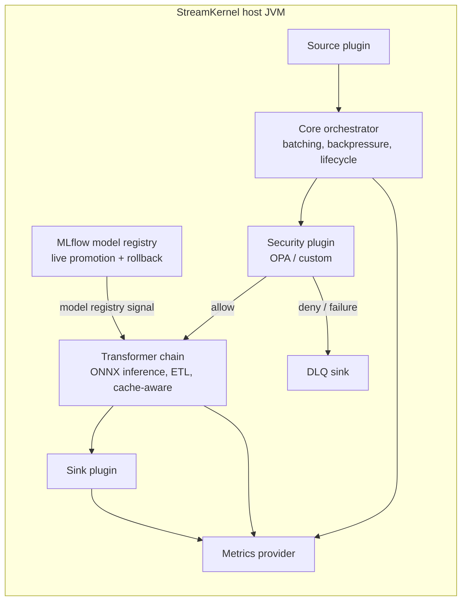

# StreamKernel

[](https://github.com/IntuitiveDesigns/StreamKernel-io/stargazers)
[](https://github.com/IntuitiveDesigns/StreamKernel-io/releases)
[](LICENSE)
[](PATENT-NOTICE.md)

<p align="center">
  
  
  
  
  
  
  
  
  
  
  
  
  
  
  
  
  
</p>

Architected by [Steven Lopez](https://www.linkedin.com/in/steve-lopez-b9941/).

StreamKernel is a source-available JVM pipeline runtime with a protected commercial AI path for teams that need in-process enrichment, policy enforcement, transformation, caching, DLQ routing, and multi-destination delivery inside one fast, auditable process. The public repository shows the runtime boundary, SDK contracts, benchmark evidence, and buyer-facing AI capability; private model artifacts and protected DJL/ONNX/MLflow implementation details are withheld for IP protection and commercial licensing.

The category is not "another Kafka client" or "a smaller Spark." StreamKernel sits between event transport, operational systems, and analytical platforms: a programmable pipeline kernel where AI enrichment, policy, and delivery share a single runtime boundary.

## Buyer Pain

Most event platforms solve transport, storage, or analytics. Production teams still have to glue together policy sidecars, cache clients, DLQs, schema transforms, model or embedding calls, model version management, metrics, retry logic, and destination-specific writers. That glue becomes the product: it is expensive to build, hard to benchmark, harder to audit, and painful to move across Kafka, Pulsar, REST, MongoDB, Delta, Snowflake, and local test profiles.

StreamKernel turns that glue into a runtime:

- one `.properties` file per pipeline
- one JVM process for source, policy, transform, ONNX inference, cache, sink, DLQ, and metrics
- one protected commercial model registry integration for live promotion and automated rollback
- one SPI for author-owned plugins
- one benchmark runner that records the exact JVM and runtime envelope

## What It Is For

- AI enrichment pipelines that need in-process inference, model version governance, and provenance without a sidecar or remote inference service.
- Regulated event pipelines that need per-batch policy, audit headers, DLQ handling, and reproducible evidence.
- Teams that want Kafka, Pulsar, REST, Delta, Snowflake, MongoDB, and DevNull paths without rewriting the orchestration layer.
- Platform teams that want customers or internal groups to bring their own plugins without giving up runtime control.

## Why Companies Contact

| Buyer trigger | Why StreamKernel is worth a conversation |
|---|---|
| AI needs to happen in the event path, not after the fact | Protected DJL/ONNX enrichment runs inside the pipeline boundary, avoiding a separate model-serving hop for every record. |
| Model changes need operational guardrails | MLflow registry integration gives teams a path for model promotion, provenance, and health-gated rollback without redeploying the pipeline. |
| AI output must be auditable | Enriched records can carry model/version/run labels into Kafka, MongoDB vector collections, Delta Lake, Snowflake, or custom sinks. |
| Glue code is becoming the product | Source, policy, transform, inference, cache, DLQ, metrics, and sink behavior share one JVM lifecycle and one benchmark envelope. |
| The deployment has to fit an enterprise or OEM boundary | Commercial licensing can cover private builds, redistribution, managed services, support, and negotiated patent rights. |

The public repo intentionally gives buyers enough to evaluate the architecture and evidence. A commercial conversation is where private demos, implementation review under NDA, production packaging, and license terms belong.

## Architecture



More detail: [ARCHITECTURE.md](ARCHITECTURE.md), [MODULES.md](MODULES.md), and [MLFLOW_AI_INTEGRATION.md](MLFLOW_AI_INTEGRATION.md).

## Commercial AI Capability: DJL + ONNX + MLflow

StreamKernel's AI differentiator is not just that it can call a model. The commercial value is that model inference, policy, provenance, delivery, DLQ handling, and runtime metrics can live inside one operational pipeline boundary. That is the part companies usually have to assemble from sidecars, model servers, orchestration scripts, retry logic, custom sink writers, and audit glue.

The public repository deliberately publishes the buying evidence rather than the protected implementation: what runs, what it integrates with, what the benchmark logs prove, and where the commercial licensing boundary starts. Private model artifacts, protected lifecycle mechanics, and proprietary adapter code are not published here.

| Capability | Buyer reason |
|---|---|
| DJL + ONNX in-process enrichment | Run embedding or classification-style enrichment in the JVM pipeline instead of adding a per-record network hop to a separate inference service. |
| MLflow model registry integration | Treat the model registry as an operational control point for bootstrap, promotion, provenance, and rollback evidence. |
| Live model promotion and rollback evidence | Demonstrates that StreamKernel can keep the pipeline running while model governance events happen. |
| Multi-sink AI delivery | Carry enriched records to Kafka, MongoDB vector collections, Delta Lake, Snowflake, or custom enterprise sinks. |
| Per-record model provenance | Preserve model/version/run labels for regulated environments, audit review, and downstream investigation. |
| Benchmarkable runtime envelope | Show customers throughput, latency, record counts, JVM settings, and sink behavior from reproducible runs. |

Full evidence and the public/private boundary: [MLFLOW_AI_INTEGRATION.md](MLFLOW_AI_INTEGRATION.md).

## Reproducible Benchmark Suite

### Local Docker Setup

Most local benchmark rows need the `broker` service, and the compose broker always
configures both PLAINTEXT and SSL listeners. Generate local development
keystores before starting Kafka, even when the profile itself uses
`localhost:9092` PLAINTEXT:

```bash
bash scripts/gen-certs.sh
```

On Windows with Git Bash, disable MSYS path conversion so OpenSSL subject names
are not rewritten:

```powershell
$env:MSYS_NO_PATHCONV = "1"
& "C:\Program Files\Git\bin\bash.exe" scripts/gen-certs.sh
```

The script creates `secrets/kafka.server.keystore.p12`,
`secrets/kafka.client.keystore.p12`, `secrets/kafka.truststore.p12`, and the
Confluent `*_creds` files. These files are ignored by git. They are required by
Kafka-backed rows, mTLS rows, OIDC rows that still start the shared broker, and
Pulsar profiles that write into Kafka.

On Apple Silicon Macs, `docker-compose.yaml` defaults local services to
`linux/amd64` through `STREAMKERNEL_DOCKER_PLATFORM` because several benchmark
images are x86-first. Docker Desktop runs them under emulation. Override that
variable only after confirming every service in your selected profile has a
native ARM64 image.

The public suite is driven by CSV matrices in `benchmark-runs/`:

- `benchmark-runs/tests.csv`: primary CPU benchmark suite
- `benchmark-runs/tests_oidc.csv`: OIDC/security-oriented suite
- `benchmark-runs/tests_lineage.csv`: provenance/audit evidence
- `benchmark-runs/tests_pulsar.csv`: Pulsar source portability burst drain
- `benchmark-runs/tests_pulsar_live.csv`: live Pulsar source pressure
- `benchmark-runs/tests_snowflake.csv`: Snowflake Snowpipe Streaming sink

Each row names the pipeline config, JVM heap, GC mode, runtime duration, topic settings, run ID, executor mode, cache mode, and sink-copy behavior. The runner emits logs, GC output, Prometheus snapshots, effective settings, and `meta.json` for replay.

```powershell
.\gradlew.bat --no-daemon :streamkernel-app:shadowJar
.\test-java-runner.ps1 -MatrixFile .\benchmark-runs\tests.csv -SingleTest streamkernel_kafka_at_least_once_baseline_10m
```

Full instructions: [docs/18_benchmark_runner.md](docs/18_benchmark_runner.md) and [BENCHMARK_SUITE.md](BENCHMARK_SUITE.md).

## Public Use Cases

| Use Case | Command |
|---|---|
| MongoDB insert baseline | `.\test-java-runner.ps1 -MatrixFile .\benchmark-runs\tests.csv -SingleTest streamkernel_mongodb_insert_baseline_10m` |
| Delta/Spark local lakehouse | `.\test-java-runner.ps1 -MatrixFile .\benchmark-runs\tests.csv -SingleTest streamkernel_delta_spark_local_5m` |
| Lineage audit headers | `.\test-java-runner.ps1 -MatrixFile .\benchmark-runs\tests_lineage.csv -SingleTest streamkernel_lineage_audit_10m` |
| Pulsar source burst drain | `.\test-java-runner.ps1 -MatrixFile .\benchmark-runs\tests_pulsar.csv` |
| Live Pulsar source pressure | `.\test-java-runner.ps1 -MatrixFile .\benchmark-runs\tests_pulsar_live.csv` |
| Snowflake Snowpipe Streaming | `.\test-java-runner.ps1 -MatrixFile .\benchmark-runs\tests_snowflake.csv` |

The Delta/Spark and Snowflake profiles use a deterministic public enrichment transform so the connector paths can be published and replayed without private model artifacts.

## Measured Baselines

Published rows were run on an Intel i9-8950HK laptop with 6 cores, 12 threads, and 32GB RAM against a local Docker environment.

**Transport and delivery baselines:**

| Profile | Avg Throughput | Records | Delivery | Notes |
|---|---:|---:|---|---|
| [Kafka Bench (NOOP)](benchmark-runs/reports/kafka/StreamKernel_Story_KafkaBench_563M.pdf) | 956K ops/sec | 563M | At-least-once | Raw Kafka producer ceiling |
| [Kafka ALO (WireEvent)](benchmark-runs/reports/kafka/StreamKernel_Story_ALO_OptimizationRun3.pdf) | 525K ops/sec | 313M | At-least-once | Transform, 512-byte payload |
| [Kafka EOS (WireEvent)](benchmark-runs/reports/kafka/StreamKernel_Story_Kafka_ExactlyOnce.pdf) | 507K ops/sec | 301M | Exactly-once | -3.5% vs ALO |
| [mTLS + OPA (NOOP)](benchmark-runs/reports/kafka/StreamKernel_Story_mTLS_OPA_217M.pdf) | 366K ops/sec | 217M | At-least-once | TLSv1.3 plus fail-closed OPA |
| [MongoDB Insert](benchmark-runs/reports/mongodb/StreamKernel_Story_MongoDB_Insert_95M.pdf) | 163K docs/sec | 95.5M | At-least-once | insertMany baseline |
| [Pulsar Source Burst Drain](benchmark-runs/reports/pulsar/streamkernel_pulsar_kafka_whitepaper.pdf) | 15.6K rec/sec peak window | 253,235 | Pulsar -> Kafka | STRING_TO_WIREEVENT baseline; backlog drained in ~20s, then idle to 10-minute shutdown |
| [AI Infrastructure Impact Brief](benchmark-runs/reports/ai/The_Hidden_Environmental_Cost_of_AI_Infrastructure.pdf) | n/a | n/a | Research brief | Environmental and infrastructure-cost context for efficient AI-adjacent pipelines |

**AI enrichment baselines (May 4, 2026 — see [MLFLOW_AI_INTEGRATION.md](MLFLOW_AI_INTEGRATION.md) for full evidence):**

| Profile | Avg Throughput | Records | Sink | Notes |
|---|---:|---:|---|---|
| ONNX Embedding → Kafka (TIER A) | 204 eps | 122,272 | Kafka | DIRECT_TEXT mode; P50 ~298ms, P99 ~400ms |
| ONNX Embedding → MongoDB Vector | 331 eps | 198,560 | MongoDB vector | Zero record loss |
| MLflow Bootstrap → Delta Lake | 38 eps | 11,072 | Delta Lake | MLflow champion artifact at startup |
| Pulsar → ONNX → Delta Lake | 16 eps | 9,600 | Delta Lake | Transport-agnostic AI path |
| Lineage Audit (DJL chain) | 36 eps | 21,504 | Kafka | Provenance headers, 10-minute sustained |
| Live Model Swap + Rollback | — | 10,496 | Kafka | Promote v4→v10; auto-rollback in ~4s; zero restarts |

> AI enrichment evidence was generated from the protected AI build: ONNX Runtime 1.20.0, DJL 0.32.0, MiniLM-L6-v2, CPU-only, single JAR, local Docker. The public repo documents evidence and integration boundaries; it does not publish private model artifacts or protected implementation code.

## Why Not Kafka/Flink/Spark/Databricks Alone?

Use those platforms where they are strongest. StreamKernel is for the operational gap around them: fast per-event AI enrichment, policy, and delivery inside one embeddable runtime.

| Platform | Strong At | Gap StreamKernel Targets |
|---|---|---|
| Kafka | Durable event transport | Does not provide a pipeline kernel for policy, cache, in-process inference, DLQ, and destination writes. |
| Flink | Stateful stream processing | Heavier cluster/runtime model when the job is local AI enrichment, policy, or sink fanout. |
| Spark | Batch and large-scale analytics | Not designed for low-latency single-process operational AI event paths. |
| Databricks | Managed lakehouse and ML platform | Excellent destination/control plane; MLflow registry is a natural pairing. StreamKernel is the embeddable runtime that consumes from that registry and enriches events at the edge. |
| Sidecar inference services | Remote model serving | Network hop per record, no shared batch lifecycle with the pipeline, no integrated rollback. |

Full comparison: [COMPARISON.md](COMPARISON.md).

## SPI Moat

The Apache 2.0 SDK modules expose the plugin contracts. Plugin authors implement `SourcePlugin`, `TransformerPlugin`, `SinkPlugin`, cache, security, DLQ, or metrics contracts and keep their plugin IP. StreamKernel keeps the runtime kernel, lifecycle, batching, backpressure, policy, provenance, metrics, and DLQ semantics consistent.

Example: [docs/plugin-example.md](docs/plugin-example.md).

## Five-Minute Demo

Use the demo script to show the value quickly: build the JAR, run a reproducible benchmark row, inspect the matrix, point to the architecture, and close on plugin ownership plus commercial licensing.

Script: [DEMO_5_MIN.md](DEMO_5_MIN.md).

## Licensing

Clear boundary:

- Core runtime and first-party modules are source-available under the StreamKernel Source Available License.
- `streamkernel-api`, `streamkernel-spi`, and `streamkernel-metrics/metrics-api` are Apache 2.0 SDK modules.
- Custom plugins built against the SDK remain author-owned. The StreamKernel license does not take ownership of independently authored plugins.
- Commercial licenses are available for redistribution, OEM embedding, managed services, support, and negotiated patent rights.

Details: [LICENSE-HISTORY.md](LICENSE-HISTORY.md), [COMMERCIAL.md](COMMERCIAL.md), [PATENT-NOTICE.md](PATENT-NOTICE.md), and [THIRD-PARTY-NOTICES.md](THIRD-PARTY-NOTICES.md).

## Quick Links

| Need | Link |
|---|---|
| Architecture | [ARCHITECTURE.md](ARCHITECTURE.md) |
| AI enrichment + MLflow evidence | [MLFLOW_AI_INTEGRATION.md](MLFLOW_AI_INTEGRATION.md) |
| Module boundaries | [MODULES.md](MODULES.md) |
| Benchmark suite | [BENCHMARK_SUITE.md](BENCHMARK_SUITE.md) |
| Runner details | [docs/18_benchmark_runner.md](docs/18_benchmark_runner.md) |
| Platform comparison | [COMPARISON.md](COMPARISON.md) |
| AI infrastructure impact | [benchmark-runs/reports/ai/The_Hidden_Environmental_Cost_of_AI_Infrastructure.pdf](benchmark-runs/reports/ai/The_Hidden_Environmental_Cost_of_AI_Infrastructure.pdf) |
| Demo script | [DEMO_5_MIN.md](DEMO_5_MIN.md) |
| Plugin example | [docs/plugin-example.md](docs/plugin-example.md) |
| Commercial licensing | [COMMERCIAL.md](COMMERCIAL.md) |

Contact: [LinkedIn](https://www.linkedin.com/in/steve-lopez-b9941/) · [GitHub Issues](https://github.com/IntuitiveDesigns/StreamKernel-io/issues)
